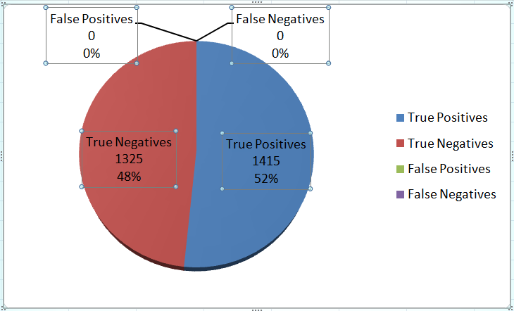
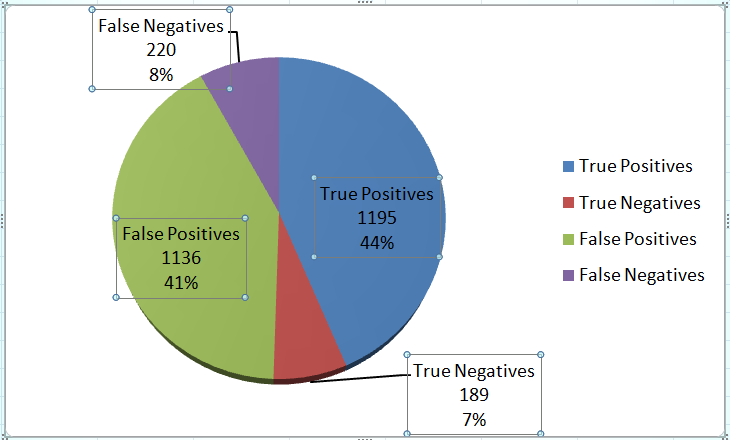
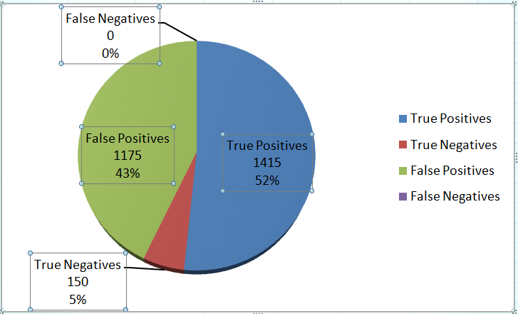
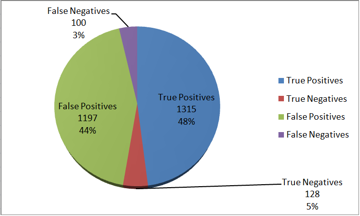

# SecEval4CodeLLM


## Overview

This is a project that evaluates the security of code generated by LLM.

It can perform security assessments on different LLMs using evaluation datasets of various programming languages.
Users can configure the LLM to be evaluated and select the evaluation dataset of interest. 
Additionally, users can adjust the API interval time and retry count based on the capabilities of the LLM.


## Installation

Some third-party modules need to be installed by yourself, such as installing pymysql. The installation method is as follows:

```
pip install python==3.7
pip install pandas
pip install bs4
pip install lxml
pip install fuzzywuzzy
pip install langchain
pip install asyncio
pip install aiohttp
pip install retry
```


## Documentation

1. edit config.ini
2. run main.py

Notes:
1. Interface Response Jitter
    Currently, the LLMAssistant may encounter timeouts and other errors, especially in the later stages of test execution, which may be related to the service's acceptance capacity.
    The approach to handling this is to add retry logic at the interface call site, with a default of 3 retries and a 1-second interval between each retry.
    Apart from increased latency, there are no other known side effects. However, if the service's acceptance capacity is limited, it may be challenging to resolve completely.
3. Returned Data Jitter
    On one hand, the LLMAssistant's returned values exhibit uncertainty, sometimes able to identify vulnerabilities and other times not.
    On the other hand, the current LLMAssistant lacks the FuncCall functionality (supported by ChatGPT). As a result, the returned content does not always adhere to the prompt requirements, making parsing difficult.
    The approach to handling this is to add retry logic when parsing the returned values. If no vulnerabilities are found, a default of 3 retries with a 1-second interval between each retry is applied.
    Apart from increased latency, this approach can improve the True Positives (TP) metric but may also increase the False Positives (FP) metric, making it difficult to achieve both simultaneously.
4. Performance
    Although non-streaming responses were implemented to reduce network overhead, the response time is still relatively slow due to LLM generating the next token based on the previous token.
    In synchronous evaluation mode, approximately 60 cases can be processed per hour, and it would take around 48 hours to handle 2740 test cases.
    Switching to asynchronous evaluation significantly improves performance while accommodating the aforementioned retries. With asynchronous evaluation, it would take approximately 6 hours to handle 2740 test cases.
    Currently, the evaluation is performed asynchronously, processing 32 test cases per batch (limited by local machine performance). Considering that this operation is not frequent, it meets the current requirements. Further optimizations will be considered if there is a need for performance improvements in the future.


## Stats

In binary classification problems, such as those in machine learning, the performance of a model is often evaluated using a Confusion Matrix.
The Confusion Matrix consists of four fundamental terms: True Positives (TP), True Negatives (TN), False Positives (FP), and False Negatives (FN).
    
    True Positives (TP):
        Definition: Represents the cases where the model correctly predicts positive class samples as positive.
        Example: In the security evaluation of code generated by LLM, TP represents the cases where the model correctly predicts vulnerable examples as having vulnerabilities.
    True Negatives (TN):
        Definition: Represents the cases where the model correctly predicts negative class samples as negative.
        Example: In the security evaluation of code generated by LLM, TN represents the cases where the model correctly predicts non-vulnerable examples as not having vulnerabilities.
    False Positives (FP):
        Definition: Represents the cases where the model incorrectly predicts negative class samples as positive.
        Example: In the security evaluation of code generated by LLM, FP represents the cases where the model incorrectly predicts non-vulnerable examples as having vulnerabilities.
    False Negatives (FN):
        Definition: Represents the cases where the model incorrectly predicts positive class samples as negative.
        Example: In the security evaluation of code generated by LLM, FN represents the cases where the model incorrectly predicts vulnerable examples as not having vulnerabilities.

These four metrics provide a comprehensive assessment of model performance, especially when dealing with imbalanced datasets.
Based on these metrics, many other evaluation measures can be calculated, such as accuracy, precision, recall, and F1 score, to gain a more detailed understanding of the model's performance.











## ToDo
    - [X] LLMs
      - [X] StarCoder
      - [X] LLaMA
      - [X] CodeGen
      - [X] PaLM
      - [X] ...
      
    - [X] DataSets
      - [X] tuhh
      - [X] sven
      - [X] CVT
      - [X] ...


## References
1. **[LLM_code_scanning_evals](https://github.com/gpsandhu23/LLM_code_scanning_evals)**
2. **[BenchmarkJava](https://github.com/OWASP-Benchmark/BenchmarkJava)**
3. **[tuhh](https://github.com/tuhh-softsec/LLMSecEval/tree/main/Code%20Generation)**
4. **[sven](https://github.com/eth-sri/sven/tree/master)**
5. **[CVT](https://github.com/CommissarSilver/CVT/tree/main)**

